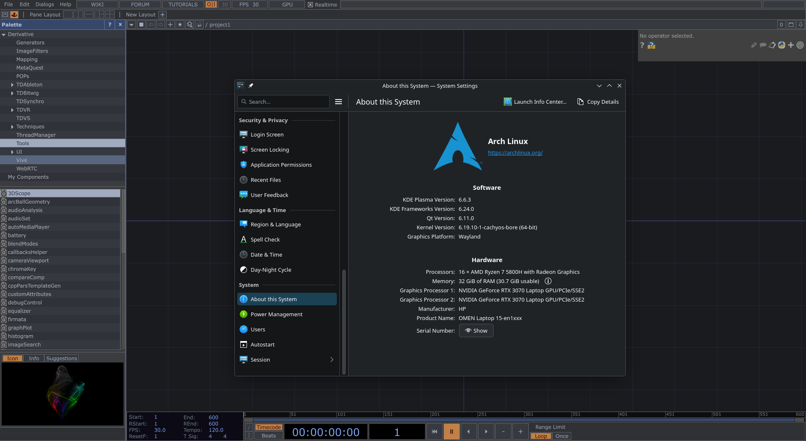
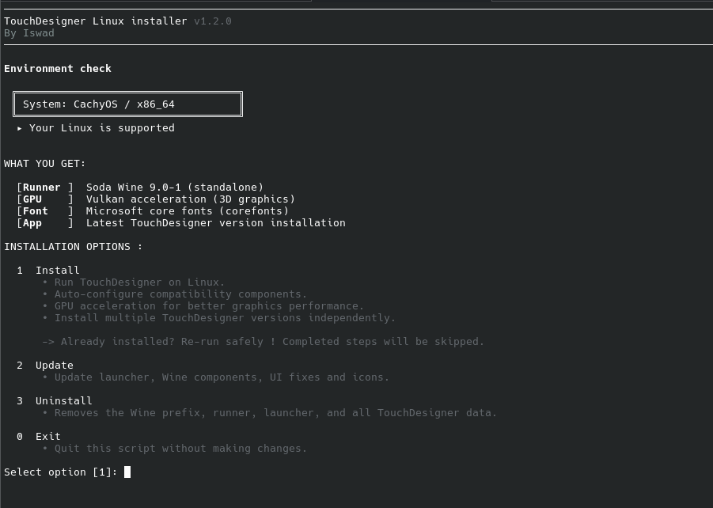
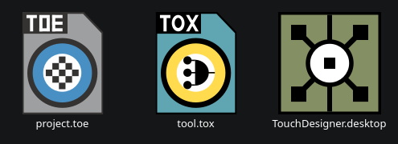

# TouchDesigner-Linux

[](https://github.com/ismail-bahloul/TouchDesigner-Linux/actions)
[](https://python.org)
[](https://aur.archlinux.org/packages/touchdesigner-linux)

Run TouchDesigner on Linux via Wine, fully automated.
One command, works on any distro.



👉 [Roadmap & planned features](ROADMAP.md)

---

## Quick Install



**Any distro (recommended):**
```bash
curl -sSL https://raw.githubusercontent.com/ismail-bahloul/TouchDesigner-Linux/main/install.sh | bash
```

**Arch Linux (AUR):**
```bash
paru -S touchdesigner-linux
```

> 5-10 min, ~3-5 GB disk, auto-cleanup

> NVIDIA users: install the GPU driver first, then reboot. On SteamOS, the
> read-only root is disabled automatically (needs your sudo password).

Native desktop icons for `.toe` and `.tox` files:



**Debug mode:**
```bash
DEBUG=true curl -sSL https://raw.githubusercontent.com/ismail-bahloul/TouchDesigner-Linux/main/install.sh | bash
```

**Container mode** (install on an untouched host system):
```bash
curl -sSL https://raw.githubusercontent.com/ismail-bahloul/TouchDesigner-Linux/main/install.sh | bash -s -- --container
```
See [docs/container.md](docs/container.md) for how it works, GPU notes and
limitations.

---

## Update & Uninstall

### Any distro
- **Update** -> Run the installer and choose **2. Update**
- **Uninstall** -> Run the installer and choose **3. Uninstall**

Regenerates launcher, winetricks, DXVK, and UI fixes. No need to reinstall TD or recreate the Wine prefix.

**Note:** a full uninstall removes everything, including your TouchDesigner license activation (`ins*.dat`) — you will need to re-enter your license key after reinstalling. The uninstaller warns you before deleting it.

### Arch Linux (AUR)

**Update**
```bash
paru -Syu
```

**Uninstall**
```bash
paru -R touchdesigner-linux
```

---

## First Launch

The font fix (`wine_ui_fixes.tox`) is injected into `.toe` files on launch.
The **license activation screen** loads before any `.toe`, so text may look broken.

1. Launch TD → license screen (missing text is **normal**)
2. Enter your license, close TD
3. Launch again → fonts are fixed

---

## Documentation

- [How it works](docs/how-it-works.md) — explains each fix and why it's applied
- [Compatibility status](docs/compatibility.md) — what works and what doesn't
- [Wine runners comparison](docs/runners.md) — tested runners, source analysis, compatibility
- [Troubleshooting](docs/troubleshooting.md) — common issues and fixes
- [CodeMeter dongles & network licenses](docs/codemeter.md) — use a license dongle over the LAN
- [Container mode (Distrobox)](docs/container.md) — run on an untouched host system
- [Python packages via pip](docs/advanced-tools.md) — `td-install --pip install <package>`
- [Advanced tools](docs/advanced-tools.md) — toeexpand / toecollapse
- [CI notes](docs/ci.md) — maintainer notes on the GitHub Actions setup, headless Wine gotchas

### Useful paths

| Path | Description |
| --- | --- |
| `~/.local/bin/touchdesigner` | Terminal command (launch TD, open `.toe` files) |
| `~/.local/bin/launch-touchdesigner.sh` | Launcher script |
| `~/.local/share/touchdesigner-linux/` | Base directory (runner, prefix, assets) |
| `~/.local/share/touchdesigner-linux/prefix/` | Wine prefix |
| `~/.local/share/touchdesigner-linux/backups/` | Auto-backups of patched `.toe` files |

---

## Support

If this project helps you:
- ⭐ **Star** the repo
- Support via [GitHub Sponsors](https://github.com/sponsors/ismail-bahloul)

---

<div align="center">Built with care - <b>Iswad</b></div>
